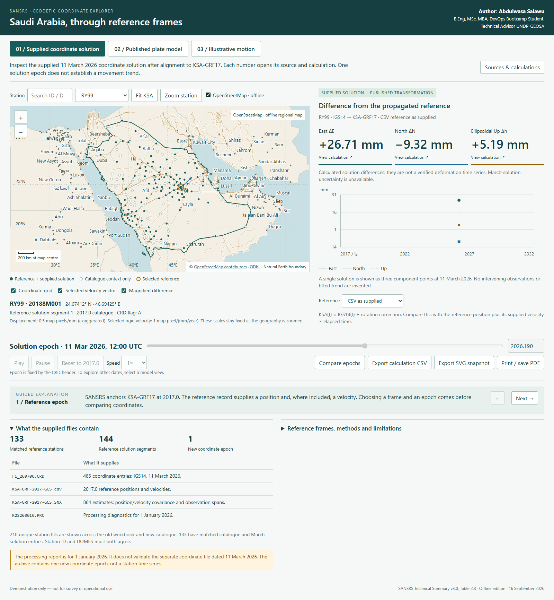

# Abdulwasaiu

## KSA Coordinate Explorer V3 Offline

[Open the project documentation](ksa-coordinate-explorer/README.md).

Download this repository as a ZIP, extract it, and double-click
`ksa-coordinate-explorer/index.html` to run the application locally.
The regional OpenStreetMap background, coordinate data and application source
are included. No Codex, internet connection, installation or server is required.

